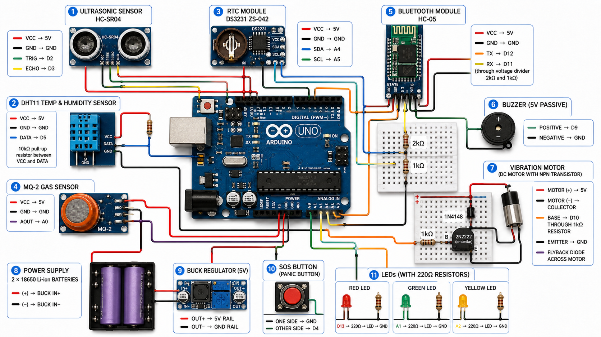
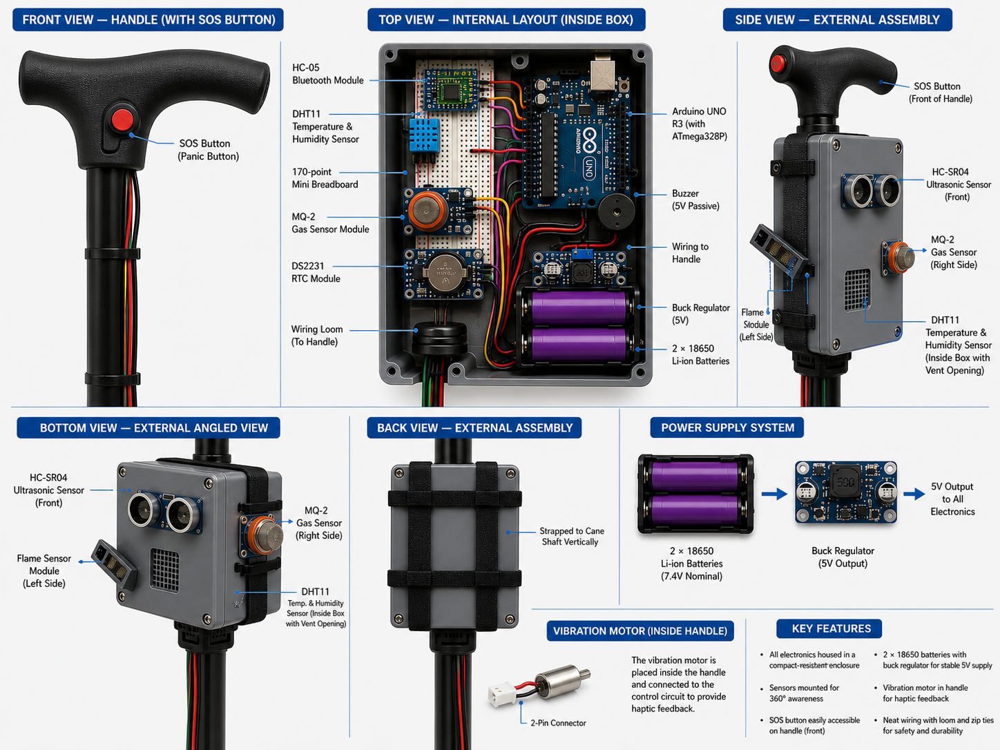
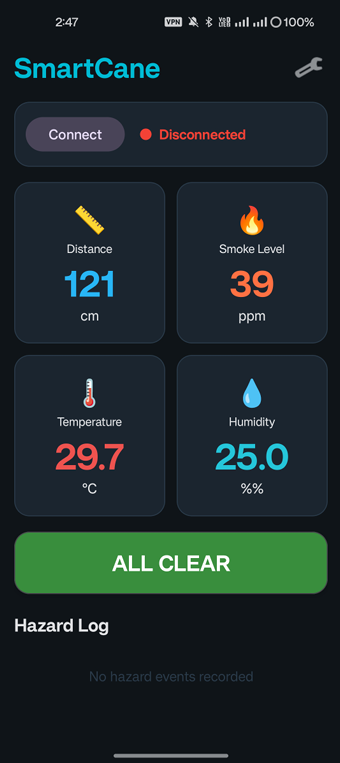
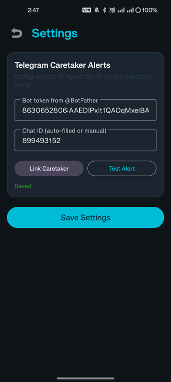
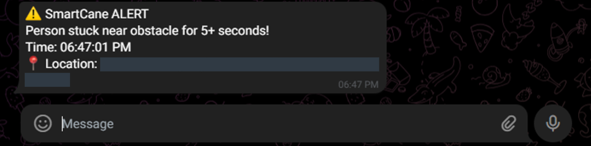

# Smart Blind Assistance Cane

<p align="center">
  
  
  
  
</p>

<p align="center">
  <b>An intelligent embedded assistive device for visually impaired individuals</b><br>
  <i>Real-time obstacle detection, environmental hazard monitoring, and automated caretaker alerts</i>
</p>

---

## Table of Contents

- [Overview](#overview)
- [Features](#features)
- [Hardware Architecture](#hardware-architecture)
- [Software Architecture](#software-architecture)
- [Alert Priority System](#alert-priority-system)
- [Installation & Setup](#installation--setup)
- [Wiring Diagram](#wiring-diagram)
- [Usage](#usage)
- [SmartCane Android App](#smartcane-android-app)
- [Telegram Caretaker Alerts](#telegram-caretaker-alerts)
- [Project Structure](#project-structure)
- [Team](#team)
- [Acknowledgments](#acknowledgments)

---

## Overview

The **Smart Blind Assistance Cane** is a wearable embedded system designed to enhance mobility and safety for visually impaired individuals. Built on the **Arduino UNO** platform, the cane integrates multiple environmental sensors to detect physical obstacles, gas/smoke hazards, and extreme temperatures. All sensor data is streamed in real time via **Bluetooth SPP** to the companion **SmartCane Android application**, which provides local voice and vibration alerts to the user and automatically notifies a designated caretaker through **Telegram** with GPS-tagged location links for critical events.

---

## Features

### 🔍 Multi-Sensor Detection
- **Obstacle Detection**: HC-SR04 ultrasonic sensor with 2–400 cm range
- **Gas & Smoke Detection**: MQ-2 sensor for smoke, LPG, and carbon monoxide
- **Temperature & Humidity**: DHT11 digital sensor for environmental monitoring
- **Real-Time Clock**: DS3231 (ZS-042) module for accurate hazard timestamping

### 📳 Multi-Modal Feedback
- **On-Cane Alerts**: Buzzer and vibration motor with priority-mapped patterns
- **LED Indicators**: Red, Green, and Yellow LEDs for visual status indication
- **App Alerts**: Text-to-speech voice prompts and vibration patterns via Android
- **Remote Alerts**: Automated Telegram messages to caretakers with GPS location

### 📱 Companion Android App
- Live sensor dashboard (Distance, Smoke, Temperature, Humidity)
- Bluetooth SPP connectivity with structured message protocol
- Four-tier safety state classification engine
- Scrollable hazard event log with RTC timestamps
- Configurable Telegram Bot integration for caretaker notifications
- GPS location attachment in emergency alerts

### 🆘 SOS Panic Button
- Physical button on the cane handle for immediate rescue requests
- Triple LED flash + triple beep + motor pulse feedback
- Instant Telegram alert with timestamp to caretaker

---

## Hardware Architecture

### Component List

| # | Component | Model | Purpose |
|---|-----------|-------|---------|
| 1 | Microcontroller | Arduino UNO R3 (ATmega328P) | Main processing unit |
| 2 | Ultrasonic Sensor | HC-SR04 | Obstacle distance measurement |
| 3 | Gas/Smoke Sensor | MQ-2 | Smoke and gas detection |
| 4 | Temperature & Humidity | DHT11 | Environmental monitoring |
| 5 | Real-Time Clock | ZS-042 (DS3231) | Hazard event timestamping |
| 6 | Bluetooth Module | HC-05 | Wireless data transmission |
| 7 | Buzzer | 5V Passive | Audio alerts |
| 8 | Vibration Motor | Small DC + NPN Transistor | Haptic feedback |
| 9 | LEDs | Red, Green, Yellow | Visual status indicators |
| 10 | Power Supply | 7.4V Batteries | Portable power |

### Pin Assignment

| Arduino Pin | Connected To | Notes |
|-------------|--------------|-------|
| **D2** | HC-SR04 TRIG | Ultrasonic trigger |
| **D3** | HC-SR04 ECHO | Ultrasonic echo |
| **D4** | SOS Button | `INPUT_PULLUP` — no external resistor needed |
| **D5** | DHT11 DATA | 10kΩ pull-up between VCC and DATA |
| **D9** | Buzzer (+) | 5V passive buzzer |
| **D10** | Motor Transistor BASE | 1kΩ base resistor |
| **D11** | HC-05 RXD | Through voltage divider (2kΩ + 1kΩ) |
| **D12** | HC-05 TXD | Direct connection |
| **D13** | Red LED | 220Ω resistor to GND |
| **A0** | MQ-2 AOUT | Analog smoke level |
| **A1** | Green LED | 220Ω resistor to GND |
| **A2** | Yellow LED | 220Ω resistor to GND |
| **A4** | ZS-042 SDA | I2C data line |
| **A5** | ZS-042 SCL | I2C clock line |

---

## Software Architecture

### Arduino Firmware (`Smart-Cane.ino`)

The firmware implements a non-blocking main loop with rate-limited sensor reading and Bluetooth transmission:

- **Sensor Interval**: 50ms — reads all sensors and evaluates thresholds
- **Bluetooth Interval**: 500ms — streams formatted data string to app
- **SOS Handling**: Checked every loop iteration with 200ms debounce
- **Message Protocol**: Structured pipe-delimited strings
  - Data: `DATA|D:<distance>|S:<smoke>|T:<temp>|H:<humidity>`
  - SOS: `SOS|PANIC|<timestamp>|USER_NEEDS_RESCUE`
  - Log: `LOG|<type>|<timestamp>|<distance>cm`

### Key Logic

```cpp
// Priority Evaluation (highest to lowest)
if (smoke > 400 || temp > 45°C)    → SMOKE/TEMP HAZARD (Priority 1)
else if (distance < 30cm)         → DANGER (Priority 2)
else if (distance < 80cm)           → WARNING (Priority 3)
else                               → ALL CLEAR (Priority 4)
```

### SmartCane Android App (Kotlin)

- **Native Bluetooth SPP**: Uses `BluetoothAdapter` and RFCOMM sockets without external libraries
- **Safety State Engine**: Classifies incoming data into 4 states with mapped UI/feedback
- **TTS & Vibration**: Local accessibility alerts with severity-mapped patterns
- **Telegram Bot API**: Direct HTTPS requests to `api.telegram.org` for caretaker alerts
- **GPS Integration**: Fetches location fix and embeds Google Maps link in messages
- **Cooldown Logic**: Prevents duplicate Telegram alerts during sustained hazards

---

## Alert Priority System

| Priority | State | Condition | Buzzer | Motor | LED |
|----------|-------|-----------|--------|-------|-----|
| **1** | 🔴 SMOKE/TEMP HAZARD | Smoke > 400 **OR** Temp > 45°C | 2000Hz continuous (600ms) | **ON** | Red |
| **2** | 🔴 DANGER | Distance < 30 cm | 1000Hz fast beep | **ON** | Red |
| **3** | 🟡 WARNING | Distance < 80 cm | 700Hz slow beep | OFF | Yellow |
| **4** | 🟢 ALL CLEAR | No threshold exceeded | Silent | OFF | Green |

> **Note**: Smoke/temperature hazards take absolute priority over obstacle detection. The buzzer pitch and beep frequency increase as the user approaches obstacles (closer = faster, higher-pitched alerts).

---

## Installation & Setup

### Prerequisites
- Arduino IDE (1.8.x or 2.x)
- Android Studio (for app modifications)
- HC-05 Bluetooth module paired with Android device
- Telegram Bot token from [@BotFather](https://t.me/BotFather)

### Arduino Setup

1. **Install Libraries**
   - `DHT sensor library` by Adafruit
   - `RTClib` by Adafruit

2. **Upload Firmware**
   ```bash
   git clone https://github.com/yeagx/Smart-Cane.git
   cd Smart-Cane
   # Open Smart-Cane.ino in Arduino IDE
   # Select Board: "Arduino UNO"
   # Select Port: COMx (Windows) or /dev/ttyUSBx (Linux/Mac)
   # Click Upload
   ```

3. **RTC Initialization**
   - On first upload, the RTC sets itself to the computer's compile time
   - If RTC loses power, it will auto-reset on next upload

### Android App Setup

1. Install the SmartCane APK on your Android device
2. Enable Bluetooth and pair with the HC-05 module (default PIN: `1234`)
3. Open SmartCane → Tap **Connect**
4. Navigate to **Settings** (wrench icon)
5. Enter your Telegram Bot token and Chat ID
6. Tap **Link Caretaker** then **Test Alert** to verify
7. Tap **Save Settings**

---

## Wiring Diagram

<p align="center">
  
  <br>
  <i>Figure 1.1: Smart Blind Assistance Cane Hardware Connections and Circuit Diagram</i>
</p>

### Assembly Notes
- **HC-05 Voltage Divider**: Arduino D11 (TX) → 2kΩ → HC-05 RXD, with 1kΩ to GND (5V → 3.3V logic level shift)
- **Motor Driver**: NPN transistor (e.g., 2N2222) with 1kΩ base resistor and 1N4148 flyback diode across motor terminals
- **Power**: 7.4V batteries connected to Arduino VIN and GND; all sensors powered from Arduino 5V rail
- **Enclosure**: Weather-resistant box mounted on cane shaft; vibration motor placed inside ergonomic handle grip

<p align="center">
  
  <br>
  <i>Figure 1.2: SmartCane Prototype Internal Layout and External Assembly</i>
</p>

---

## Usage

### Power On
1. Connect the 7.4V batteries
2. The system performs a 2-second sensor warm-up
3. Serial monitor shows: `System active. Monitoring started.`

### Normal Operation
- Hold the cane at a comfortable walking angle
- The ultrasonic sensor scans forward for obstacles
- **Green LED** = All clear
- **Yellow LED** + slow beep = Warning (obstacle 30–80 cm)
- **Red LED** + fast beep + vibration = Danger (obstacle < 30 cm)
- **Red LED** + high alarm + vibration = Smoke/temperature hazard

### SOS Activation
- Press and hold the SOS button on the cane handle
- System responds with triple flash/beep/vibration pattern
- Telegram alert sent instantly to caretaker with timestamp

### App Dashboard
- View real-time sensor tiles: Distance, Smoke, Temperature, Humidity
- Safety state banner shows current classification
- Scrollable hazard log records all threshold breaches with timestamps

---

## SmartCane Android App

<p align="center">
  
  &nbsp;&nbsp;&nbsp;
  
</p>

<p align="center">
  <i>Figure 2.1: Main Dashboard &nbsp;&nbsp;|&nbsp;&nbsp; Figure 2.2: Telegram Caretaker Settings</i>
</p>

### Dashboard Features
- **Connection Status**: Bluetooth connect/disconnect with state indicator
- **Sensor Tiles**: Color-coded values (blue = normal, red = hazard)
- **Safety Banner**: Large state indicator (ALL CLEAR / WARNING / DANGER / SMOKE-TEMP HAZARD)
- **Hazard Log**: Chronological list of all logged events with RTC timestamps

### Settings Features
- **Telegram Bot Token**: Paste token from @BotFather
- **Chat ID**: Auto-filled or manual entry for caretaker
- **Link Caretaker**: Validates bot and chat configuration
- **Test Alert**: Sends a test Telegram message immediately
- **Save Settings**: Persists configuration to local storage

---

## Telegram Caretaker Alerts

When critical events occur (SMOKE/TEMP HAZARD, DANGER state sustained > 5 seconds, or SOS button pressed), the SmartCane app automatically sends a Telegram message to the configured caretaker:

<p align="center">
  
  <br>
  <i>Figure 2.3: Automated Telegram Alert Notification with GPS Location</i>
</p>

**Alert Format:**
```
⚠️ SmartCane ALERT
Person stuck near obstacle for 5+ seconds!
Time: 06:47:01 PM
📍 Location: https://maps.google.com/?q=<lat>,<lon>
```

> **Privacy Note**: Location sharing requires GPS fix (outdoor or near-window usage). The app only shares location during active alerts, not continuously.

---

## Project Structure

```
Smart-Cane/
├── firmware/
│   └── Smart-Cane.ino          # Arduino UNO source code
├── app/
│   └── SmartCane/              # Android Kotlin project (optional)
├── docs/
│   ├── circuit_diagram.png      # Full wiring schematic
│   ├── prototype_layout.png     # 3D assembly views
│   ├── app_dashboard.png        # App screenshot — main screen
│   ├── app_settings.png         # App screenshot — settings screen
│   └── telegram_alert.png       # Telegram notification example
├── Documentation.pdf          # Full academic project report
├── README.md                    # This file
└── LICENSE                      # MIT License
```

---

## Safety State Classification

| State | Trigger Condition | App Color | Voice Alert | Vibration |
|-------|-------------------|-----------|-------------|-----------|
| **ALL CLEAR** | No threshold exceeded | 🟢 Green | "All clear" | None |
| **WARNING** | Distance < 80 cm | 🟡 Yellow | "Warning, obstacle ahead" | Short pulse |
| **DANGER** | Distance < 30 cm | 🔴 Red | "Danger, obstacle very close" | Continuous |
| **SMOKE/TEMP HAZARD** | Smoke > 400 OR Temp > 45°C | 🔴 Red | "Hazard detected, evacuate" | Continuous + pattern |

---

## Challenges & Solutions

| Challenge | Solution |
|-----------|----------|
| Limited Arduino UNO I/O pins | Used I2C for RTC (A4/A5), optimized pin mapping |
| Conflicting alert signals | Implemented strict 4-tier priority hierarchy |
| Bluetooth blocking main loop | Non-blocking `millis()`-based timing (50ms/500ms intervals) |
| 9V battery power drain | Efficient duty cycling; all sensors on shared 5V rail |
| Native Android Bluetooth | Built RFCOMM SPP client without external libraries |
| Duplicate Telegram spam | Added cooldown logic for sustained hazard conditions |
| GPS fix acquisition | Graceful handling; alerts sent even if GPS pending |

---

## Team

**Presented By:**
- Abdulrhman Mohamed Gomaa
- Mohamed Amgad Refat
- Mohamed Ahmed Younes

---

## Acknowledgments

- Inspired by open-source assistive technology communities and embedded systems research
- Built with Arduino ecosystem and Android native Bluetooth APIs
- Telegram Bot API for reliable, serverless caretaker notifications
- Special thanks to Dr. Mohammed Hammouda for guidance and supervision

---

## License

This project is licensed under the MIT License. See [LICENSE](LICENSE) for details.

---

<p align="center">
  <i>Built with ❤️ for accessibility and independence.</i>
</p>
